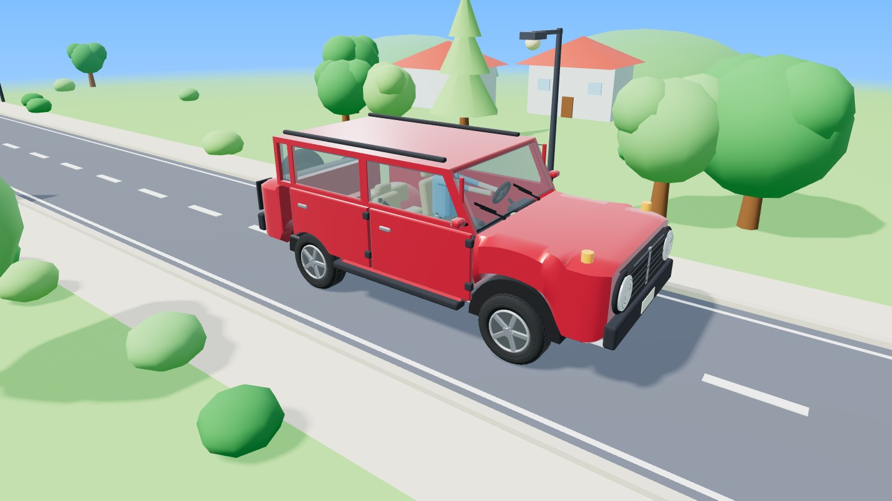

# 它怎么动？

给 3–6 岁小朋友做的机器科普站。汽车、挖掘机、飞机、洗衣机、电梯——每一个都能拖着转、点开零件听讲解、看里面、拆开看。

爸爸给三岁儿子做的，做着做着觉得别人家孩子应该也用得上，就开源了。

**在线试玩 → （把这里换成你自己的 GitHub Pages 链接）**



---

## 怎么用

### 一、直接打开就行

下载 zip → 解压 → **双击 `index.html`**。

没有安装、没有构建、不用起服务器。整个站零外部依赖，不引 CDN、不发一个网络请求，断网也能玩。手机上把文件夹拷进去同样能开。

### 二、放到网上

纯静态站，扔哪儿都能跑：GitHub Pages 打开就用，Cloudflare Pages / Vercel / 自己的 nginx 也行。
自建服务器的话，复制 `tools/deploy.sh.example` 成 `deploy.sh`，填上自己的地址即可。

### 三、想改

改 `scenes/*.js` 存盘刷新就看到效果，没有编译步骤。
只有动了页面模板 `tools/page-template.html` 才需要跑一次：

```bash
python3 tools/build_pages.py
```

（它会用模板重新生成五个页面，并给所有脚本打上 `?v=修改时间` 的缓存戳。）

---

## 关于配音

站里的讲解声音是 **edge-tts**（微软 Edge 的朗读服务）生成的，免费、不需要任何 API key。

但**音频文件没有放进仓库**——微软没有授权再分发它生成的语音。所以你下载下来第一次打开，听到的是浏览器自带的系统朗读（能用，就是机器味重一点）。

想要好听的那两个声音，跑两条命令，全部在你本地生成：

```bash
pip install edge-tts
python3 tools/gen_voice.py      # 生成 voice/yunxia/*.mp3 和 voice/xiaoyi/*.mp3
python3 tools/build_pages.py    # 刷新配音对照表
```

大约 8 MB，一两分钟。改了旁白文案后重跑一遍即可，已有的会自动跳过。

右上角可以在「云夏 / 小依 / 系统」三个声音之间切换。

---

## 建模是怎么做的

**没有一个模型文件。** 没有 .glb、.fbx、.obj——车是打开网页那一刻由 JavaScript 现算出来的。

比如 `scenes/car.js` 是 47 KB 代码，运行后生成 293 个网格、约 9.7 万三角面。用的都是 three.js 的基本体：圆柱、盒子、球、圆环，加上几个自己写的工具——车身外壳是一串圆角矩形截面沿车长放样，轮胎是断面绕轴旋转（`LatheGeometry`），胎纹是一圈 `InstancedMesh`。

这么做的好处是：**车不是"画"出来的，是用数字描述出来的**。轮眉的位置就是 `z = .970`，改成 `.963` 它就往里挪 7 毫米。整站 3D 部分不到 1 MB，手机上秒开。

代价是曲面和精细造型有天花板。想要照片级质感还是得上 Blender 导 glTF——但那样每次改动都要过一遍手工软件，对这种"随口一句就改"的项目不划算。

---

## 目录结构

```
index.html            首页
car.html …            五个物件的页面（由 tools/page-template.html 生成，别直接改）
app.js                引擎：相机、点选、透视、拆开、讲解、配音、昼夜
lib3d.js              建模工具库：放样、圆角盒、折角法线、材质、零件注册
home.js               首页那几张会转的 3D 卡片
scenes/*.js           一个物件一个文件，全部造型和动作都在里面
lib/three.min.js      three.js r128（MIT）
tools/                构建、配音生成、部署
历史版本/ 旧稿/         最早那几版，留着看演进
版本对照.html          三个版本并排对照，每一格都是活的
参考/                  美术风格参考图
```

---

## 自己加一个物件

新建 `scenes/你的物件.js`，往 `window.SCENES` 上挂一个对象：

```js
window.SCENES = window.SCENES || {};
SCENES.fan = {
  id: 'fan', title: '电风扇', subtitle: '拖一拖转圈，点零件听听',
  fit: { w: 3, h: 3, ty: .8, tyEx: 1.4, rEx: 1.3 },   // 取景范围
  order: ['blade', 'motor'],                          // 图标栏顺序
  go: { on: '吹起来', off: '停下', done: '呼～风来啦！', /* … */ },
  intro: { icon: 'blade', name: '电风扇', text: '点一点上面的零件。' },

  env(ctx, api) { /* 背景场景，可省 */ return { update() {} }; },

  build(ctx, api) {
    const { THREE, V, mm, roundedBox, paint, dark, place, defPart, markShell } = ctx;
    const blade = roundedBox(.6, .05, .12, .02, paint(0x66c2ff));
    place(blade, V(0, 1, 0), V(0, .8, 0));   // 本位、拆开后的偏移
    defPart('blade', {
      name: '扇叶', text: '扇叶转起来，把空气往前推。',
      more: '三片扇叶都是斜的，转的时候像螺旋桨一样把风送出去。',
      action() { /* 点它的时候干什么 */ }
    }, [blade]);

    return {
      update(dt) { blade.rotation.z += dt * 6; },
      chain: [ { t: '电机带着扇叶转起来。', part: 'blade', on() {} } ],  // 「开起来」按顺序讲的步骤
    };
  }
};
```

然后在 `tools/build_pages.py` 的 `PAGES` 里加一行，跑一次生成页面，再去 `index.html` 加张卡片。

`ctx` 里能拿到的建模工具：`mm / roundedBox / capsule / tubeM / pathTube / loft / stationsX / canvasTex`，材质 `paint / chrome / steel / dark / matte / flat / plastic / glassMat`，零件登记 `place / defPart / markShell`。

---

## 许可证

MIT，见 [LICENSE](LICENSE)。随便拿去改、拿去教自己家小孩。

内含 three.js（MIT，Copyright 2010-2021 Three.js Authors）。

配音音频不在仓库里，请自行用 `tools/gen_voice.py` 生成。
